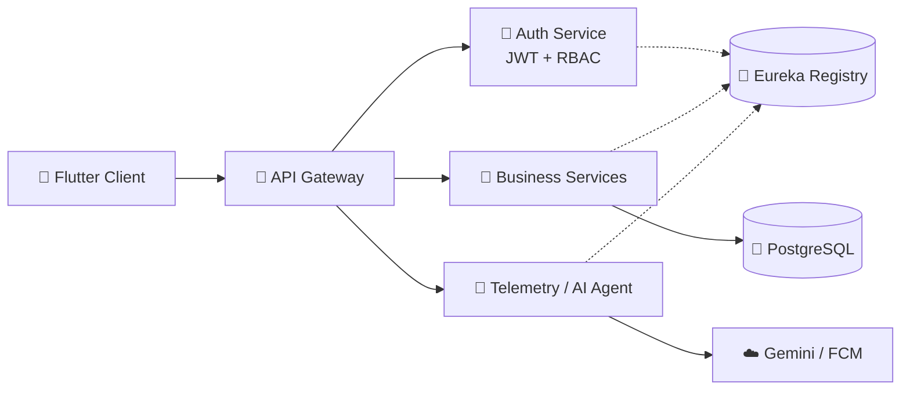

<!-- ===================== BANNER ===================== -->


<p align="center">
  
</p>

<p align="center">
  <a href="https://www.linkedin.com/in/harihar-pal"></a>
  <a href="mailto:palharihar1507@gmail.com"></a>
  <a href="https://leetcode.com/u/core_drunkncode"></a>
  
</p>

<br/>

## 👨‍💻 &nbsp;Who am I?

```java
public class Harihar {

    private final String location   = "New Delhi, India 🇮🇳";
    private final String studying   = "B.Tech CSE @ GGSIPU (CGPA 9.48)";
    private final String superpower = "Java + Spring Boot + Microservices";

    private String currentlyBuilding = "Terravox 🌍 – real-time disaster monitoring";
    private String currentlyLearning = "Agentic AI, Spring AI, System Design";
    private String funFact           = "I debug with print statements and call it 'observability'";

    public String lookingFor() {
        return "Internships & backend / AI engineering roles";
    }
}
```

<br/>

## 🧰 &nbsp;Tech Stack

<p align="center">
  <br/>
  <br/>
  
</p>

<br/>

## 🚀 &nbsp;Featured Projects

<table>
  <tr>
    <td align="center" width="50%">
      <a href="https://github.com/HariharPal/MonkMarket">
        
      </a><br/>
      <sub>🛍️ <b>AI shopping agent</b> that searches, recommends and checks out — with backend-enforced guardrails and Razorpay payments.</sub>
    </td>
    <td align="center" width="50%">
      <a href="https://github.com/HariharPal/Terravox">
        
      </a><br/>
      <sub>🌍 <b>Disaster monitoring</b> across 5 microservices, with live IoT telemetry and instant push alerts.</sub>
    </td>
  </tr>
  <tr>
    <td align="center" width="50%">
      <a href="https://github.com/HariharPal/Bozon-AI">
        
      </a><br/>
      <sub>🤖 <b>Context-aware AI assistant</b> with web search and real-time streaming responses.</sub>
    </td>
    <td align="center" width="50%">
      <b>More coming soon…</b><br/><br/>
      <sub>Check out my <a href="https://github.com/HariharPal?tab=repositories">repositories</a> 👀</sub>
    </td>
  </tr>
</table>

### 🏗️ How MonkMarket & Terravox are wired



<br/>

## 📈 &nbsp;GitHub Analytics

<p align="center">
  
  
</p>

<p align="center">
  
</p>

<p align="center">
  
</p>

<p align="center">
  
</p>

<br/>

## 🐍 &nbsp;Contribution Snake

<p align="center">
  <picture>
    <source media="(prefers-color-scheme: dark)" srcset="https://raw.githubusercontent.com/HariharPal/HariharPal/output/github-snake-dark.svg" />
    <source media="(prefers-color-scheme: light)" srcset="https://raw.githubusercontent.com/HariharPal/HariharPal/output/github-snake.svg" />
    
  </picture>
</p>

<br/>

## 🤝 &nbsp;Let's build something

<p align="center">
  Got an idea, a hackathon, or a backend problem that needs solving?<br/>
  <b>Drop me a line</b> → <a href="mailto:palharihar1507@gmail.com">palharihar1507@gmail.com</a>
</p>

<p align="center">
  
</p>
